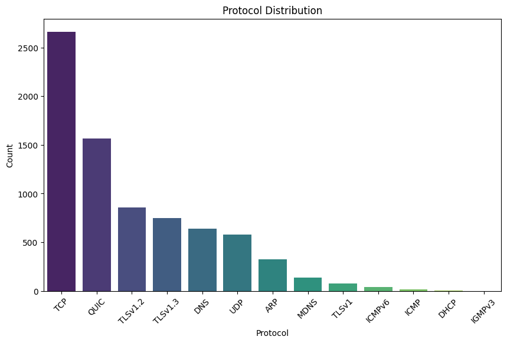
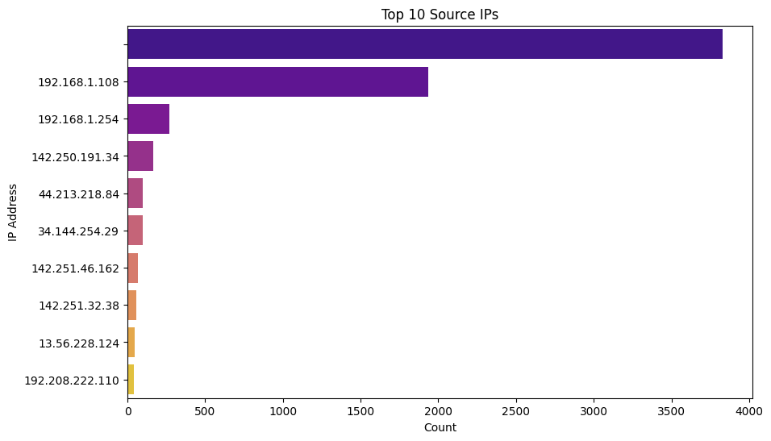
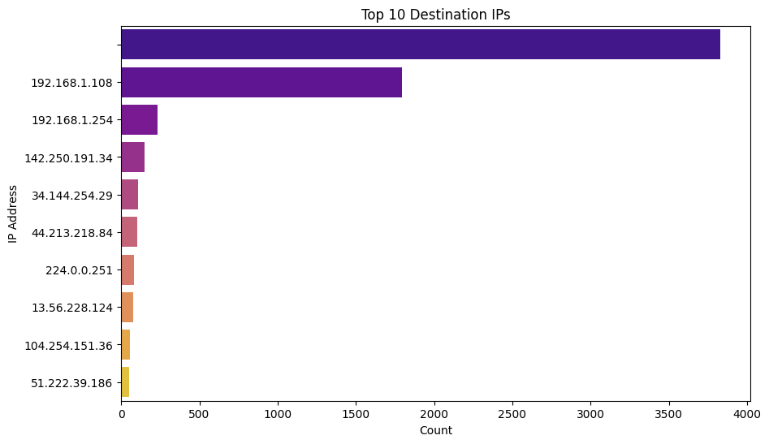
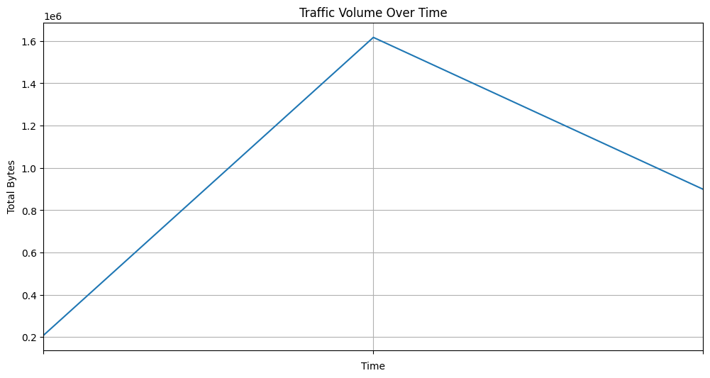
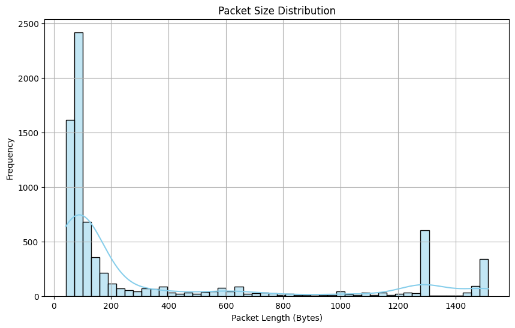

# Network Traffic Analysis and Visualization Using Python

This project is designed to analyze and visualize network traffic captured in `.pcap` files. By leveraging Wireshark's `tshark` and Python libraries, this tool provides insights into network activity through comprehensive visualizations.

## Features

- **Upload `.pcap` Files:** Analyze captured network data.
- **Data Extraction:** Extract key information like timestamps, source IPs, destination IPs, protocols, and packet lengths.
- **Data Cleaning:** Preprocess data for accurate analysis.
- **Summary Statistics:** Gain insights into packet counts, protocols, and traffic volume.
- **Visualizations:** Understand network traffic through informative plots.

## Dependencies

To run the project, ensure the following are installed:
- `tshark` (Wireshark CLI tool)
- Python libraries:
  - `pandas`
  - `matplotlib`
  - `seaborn`

You can install these with:
```bash
!apt-get install -y tshark
!pip install pandas matplotlib seaborn
```

## How It Works

1. **Upload `.pcap` File:** The tool accepts `.pcap` files containing network traffic data.
2. **Data Extraction:** Use `tshark` to extract relevant fields into a structured format.
3. **Visualization:** Generate insightful visualizations to interpret network behavior.

## Visualizations

### Protocol Distribution
Understand the frequency of various protocols in the network traffic.


### Top 10 Source IPs
Identify the most active source IPs in the traffic data.


### Top 10 Destination IPs
See which destination IPs are receiving the most traffic.


### Traffic Volume Over Time
Visualize traffic trends over time in bytes.


### Packet Size Distribution
Explore the distribution of packet sizes in the captured traffic.


## Applications

This tool is useful for:
- Network administrators monitoring performance.
- Cybersecurity analysts detecting anomalies.
- Researchers studying network patterns and trends.


## Contributing

We welcome contributions! Submit issues or pull requests to enhance this tool.

## License

This project is licensed under the MIT License. See the [LICENSE](LICENSE) file for more details.
